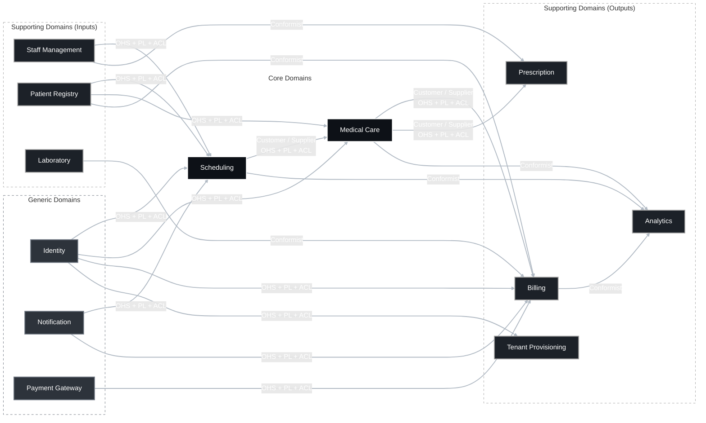

## Strategic Design

This document serves the role that in Confluence would be laid out as a "Domain Knowledge Base." It describes the full narrative of the business activity, a complete list of all subdomains with their classification, and the mapping of subdomains to bounded contexts through the concepts of problem space and solution space. In the strategic design, the subdomain-to-bounded-context mapping strives to be 1:1. This is designed so that the system maps cleanly onto a microservices architecture. All business activity is described entirely according to the Domain-Driven Design methodology and its corresponding patterns.

## 1. Domain

A platform for various private medical clinics, implemented as a multitenant SaaS. It covers the operational, clinical, and financial activity cycle of private medical clinics. A tenant in the system can manage its own isolated environment with a subscription and modular features. In terms of the domain itself, it describes the patient's journey from booking a slot with an optional prepayment, where available time is formed based on the intersection of the clinic's schedule and synchronization of doctors' personal calendars. During a visit, the system is expected to maintain an electronic medical record, record diagnoses according to ICD-10 protocols, prescribe treatment, and integrate with e-referrals and e-prescriptions. Completion of a medical service automatically triggers financial and operational processes, such as generating an invoice based on the tariffs in effect at the time of the appointment, and charging funds. In addition, the system provides a management dimension where administrators can verify the validity of staff medical licenses, manage shifts, and analyze business performance (via revenue, doctor workload, patient no-show statistics, number of issued referrals and prescriptions, reviews). On the patient side, there are appointment reminders sent a certain time in advance, and after the visit is completed the patient receives a generated invoice based on the clinic's tariffs valid at the time the service was provided.

### 1.1 Problem Space

Here is a brief terminological description to explain the categorization into subdomains and how it maps onto the system:
- **Core**: the core business logic and all the complexity of the domain. This is what distinguishes the business from its competitors and is the main source of profit. This refers only to in-house development.
- **Supporting**: an important part of the business without which the business sphere cannot function, but which does not provide a competitive advantage. There's an interesting nuance here: its absence would drive the customer away, but its presence alone doesn't attract them. It complements the business but doesn't give it a competitive edge, nor is it a reason to choose this particular system.
- **Generic**: standard business processes that work the same way across all companies; they are necessary but not unique at all. In the system, these are ready-made open-source solutions and integrations with other off-the-shelf solutions.

| Subdomain | Category | Value / Complexity | Description |
|--|--|--|--|
| **1.1 Scheduling** | Core | High / High | The heart of the clinic's operational activity. Matching a doctor's free time with patient demand, including two-way synchronization with external calendars, doctor schedules, availability of appointment slots, and booking algorithms. |
| **1.2 Medical Care** | Core | High / High | Maintaining the Electronic Medical Record. Examination and recording of symptoms (per ICPC-2 protocol), diagnoses (per ICD-10 protocol), treatment prescriptions, and medical history. |
| **1.2a Patient Registry** | Supporting | Medium / High | The patient's demographic and contact data, plus emergency contact data, i.e., full name, contacts, date of birth, emergency contacts, data-processing consents. |
| **1.3 Prescription Management** | Supporting | Medium / High | Adapter for generating e-prescriptions, industry-standard drug coding, tracking issuance status, and transmission to pharmacy networks. |
| **1.4 Tariff and Billing Management** | Supporting | Medium / High | Generating invoices based on the clinic's tariffs valid at the time the service was rendered. |
| **1.5 Lab Diagnostics Integration** | Supporting | Low / Medium | Referrals for tests, exchange of results with external laboratories per the HL7/FHIR standard, matching a result to the correct patient or visit. |
| **1.6 Staff and Credential Management** | Supporting | Low / Low | Staff shift schedules, doctors' licenses, their renewal dates, and compliance of doctor availability in the schedule. |
| **1.7 Tenant Provisioning** | Supporting | High / Medium | Clinic onboarding, data isolation, platform customization settings, the clinic's subscription to the platform itself, and internal clinic-management functionality. |
| **1.8 Analytics and Reporting** | Supporting | Medium / Medium | Aggregated metrics for clinic owners. These metrics include doctor workload, no-show rate, revenue, patient no-show statistics, number of issued referrals and prescriptions, reviews. |
| **1.9 Identity** | Generic | Low / High | Authentication and authorization, MFA for patients/doctors/admins, Role-Based Access, session management, activity history. |
| **1.10 Payment Processing** | Generic | Low / Low | Direct charging of funds from cards/accounts. |
| **1.11 Notification** | Generic | Low / Low | Technical delivery of sms/email/push messages via external gateways, with delivery-status feedback. |

**Additional notes for the whole domain**:
- Patient informed consent, and processing of special-category personal data under the "On Personal Data Protection" law, in the EU this corresponds to GDPR Art. 9.
- A cross-cutting requirement for who accessed which record and when, needed for trust and for investigations.

### 1.2 Solution Space

Designed so that each subdomain maps to a bounded context one-to-one, so that the solution space reflects the problem space as precisely as possible. Each bounded context has its own ubiquitous language internally.

| Bounded Context | For Subdomain | Principal Invariant |
|--|--|--|
| **2.1 Scheduling** | 1.1 | Multiple visits cannot overlap for the same doctor in the same room. A visit can only exist within the intersection of the doctor's schedule and the clinic's working hours. A visit cannot be double-booked. |
| **2.2 MedicalCare** | 1.2 | An EHR record cannot be retroactively modified without an explicit audit trail. A diagnosis is always linked to a valid ICD-10 code and a specific visit. |
| **2.2a PatientRegistry** | 1.2a | Within a tenant, one patient has exactly one canonical profile (deduplicated by full name + date of birth, or by identifier). |
| **2.3 Prescription** | 1.3 | A prescription cannot be issued without a confirmed diagnosis and a prescribing doctor with a valid license. |
| **2.4 Billing** | 1.4 | An invoice is generated strictly using the tariff in effect at the time the service was provided (not the current tariff) + the tariff is frozen at the time of the visit. |
| **2.5 LabDiagnostics** | 1.5 | A test result is matched to exactly one visit or patient. A referral cannot be lost without an explicit status. |
| **2.6 StaffManagement** | 1.6 | A doctor cannot be included in the appointment schedule if their license is inactive or expired on the date of the shift. |
| **2.7 TenantProvisioning** | 1.7 | A tenant does not get access to a module not covered by its subscription. Each tenant's data must be isolated from every other tenant's. |
| **2.8 Analytics** | 1.8 | Metrics must be read-only aggregates built from events of other contexts; they are never the source of truth for business decisions within the system (no write-back). |
| **2.9 Identity** | 1.9 | One account corresponds to one person; a session is always bound to a specific tenant with a specific role. The security level must give the user full transparency to understand whether their account is secure. Enhanced, mandatory security requirements apply. |
| **2.10 PaymentGateway** | 1.10 | Atomic and idempotent charging of funds, with no duplicate charges on retries. |
| **2.11 Notification** | 1.11 | Contains no business logic of any kind, such as when to deliver. Its role is strictly *how* to deliver, and it belongs to the initiating context. |

#### 1.2.1 Upstream / Downstream Bounded Contexts

| Upstream Bounded Context | Downstream Bounded Context | Relationship Type |
|--|--|--|
| Staff Management | Scheduling | OHS + PL + ACL |
| Staff Management | Prescription | Conformist |
| Patient Registry | Scheduling | OHS + PL + ACL |
| Patient Registry | Medical Care | OHS + PL + ACL |
| Patient Registry | Billing | Conformist |
| Laboratory | Billing | Conformist |
| Identity | Scheduling | OHS + PL + ACL |
| Identity | Medical Care | OHS + PL + ACL |
| Identity | Billing | OHS + PL + ACL |
| Identity | Tenant Provisioning | OHS + PL + ACL |
| Notification | Scheduling | OHS + PL + ACL |
| Notification | Billing | OHS + PL + ACL |
| Payment Gateway | Billing | OHS + PL + ACL |
| Scheduling | Medical Care | Customer / Supplier, OHS + PL + ACL |
| Scheduling | Analytics | Conformist |
| Medical Care | Billing | Customer / Supplier, OHS + PL + ACL |
| Medical Care | Prescription | Customer / Supplier, OHS + PL + ACL |
| Medical Care | Analytics | Conformist |
| Billing | Analytics | Conformist |

The table reflects the direction of influence: the upstream context dictates the model/contract, while the downstream context adapts (via an ACL or through conformism).

### 2. Ubiquitous Language

This is a dictionary of all the core terms and their meanings + the single source of truth for the language, avoiding ambiguity. This is not a final dictionary; it will keep growing along with the modeling of each context.

| Term | Context | Meaning | Forbidden Synonyms |
|--|--|--|--|
| Slot | Scheduling | A time interval available for booking, arising from the intersection of the doctor's schedule and the clinic's working hours | window, timeslot |
| Visit | MedicalCare | One completed or ongoing interaction between a patient and a doctor within a single slot | appointment, consultation |
| EMR (Electronic Medical Record) | MedicalCare | The full set of a patient's medical records within a single tenant | HR, EHR, history, medical card, patient card, medical history |
| Tariff | Billing | The price of a service, valid as of a specific date; historized, never overwritten | price, pricing, price list, cost |
| Invoice | Billing | A financial document generated after a visit is completed, based on the frozen tariff | receipt, bill, check |
| Referral | LabDiagnostics / Prescription | An electronic document for a test or consultation | request, application, referral request |
| License | StaffManagement | A doctor's legal permit to practice, with a renewal date | certificate, diploma, accreditation |
| Tenant | TenantProvisioning | A single clinic as an isolated occupant of the platform | client, organization, company, clinic |
| Patient Profile | PatientRegistry | The patient's demographic and contact data, kept separate from their Identity account and from the EMR | patient account, user, account, medical card |

### 3. Context Map

### 4. Healthcare Standards

| Term | Definition |
|--|--|
| **ICD-10** | International Classification of Diseases, 10th revision. Used for coding final diagnoses. |
| **ICPC-2** | International Classification of Primary Care. Used for coding patients' reasons for encounter and complaints. |
| **EHR (Electronic Health Record)** | The patient's complete medical history, owned by the patient, which can aggregate data from multiple sources. |
| **e-referral** | An electronic referral for a consultation or test. |
| **e-prescription** | An electronic prescription that must be transmitted to pharmacy networks. |
| **RxNorm / ATC** | Drug classification systems used for e-prescriptions. |
| **LOINC** | A knowledge base of medical terminology used to identify laboratory tests. |
| **HL7/FHIR** | Standards for exchanging medical data between systems. FHIR is the more modern standard, a RESTful layer on top of HL7. It is used for integration with laboratories or other similar systems.