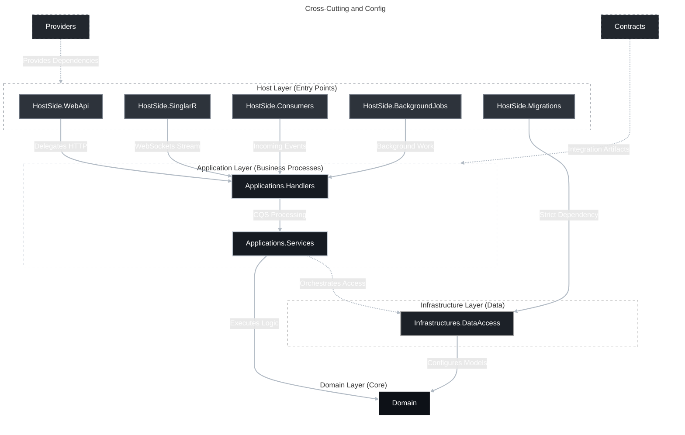

## Service structure

This file describes the standard structure of all services within the current system, meaning all services must follow this standard. All layers are designed to follow Separation Of Concerns and logically distribute responsibilities. The structure is built as a horizontal architecture similar to Clean Architecture, only slightly modified. Also, all the complexity of the system is concentrated at the domain level. Overall the architecture follows Domain-Driven-Design and Command and Query Separation.

#### Layer responsibilities at glance

| Layer | Description |
|--|--|
| **Domain** | Contains all the complexity within the current service, is a direct projection from the subdomain, applies tactical design patterns. This layer is independent of the others. |
| **Infrastuctures.DataAccess** | Configures the means for accessing external data stores. Configures domain-level models into corresponding data, depending on the store. Depends on **Domain**. |
| **Aplications.Services** | Executes the business logic defined at the domain level, also plays the role of an orchestrator between data access and the domain level. Depends on **Domain**. |
| **Applications.Handlers** | Is the entry point for starting the processing of service processes. Uses Command and Query Separation, and depending on the type of operation, processes it accordingly. Depends on **Applications.Service**s. |
| **Contracts** | Provides artifacts used for working with external services or systems. Dependency on it as needed. |
| **Providers** | Is the single source of supplying dependencies for all the above-mentioned layers for the host level from **HostSide.***|
| **HostSide.WebApi** | Is the presentation layer, the first to participate in working with client requests, is responsible for everything related to the http level. Delegates calls further into **Applications.Handlers**. |
| **HostSide.Migrations** | A separate host used for applying migrations of the corresponding external provider. Must strictly depend on **Infrastructures.DataAccess**. |
| **HostSide.Consumers** | A separate host that reacts to incoming events/messages and launches the corresponding execution pipeline. |
| **HoseSide.BackgroundJobs** | A separate host that performs all background work without loading the main service. |
| **HostSide.SinglarR** | A separate host responsible for transmitting a real-time data stream over web-sockets. |

If all layers up to the **HostSide** level are mandatory, then at the **HostSide** level, only **WebApi** is mandatory, all the rest of the hosts are optional and depend on the needs of the system.

## 1. Layer dependencies

## 2. Domain

The goal of this layer is to place all the complexity of the system in one location. This layer contains all the knowledge of the business domain. There is already a file in the documentation that describes the full strategic design of the domain. This layer is a projection of the corresponding subdomain. Speaking of implementation, this layer must be independent of the others and have no technical knowledge. The layer must not contain db-specific tools or depend on libraries like Entity Framework Core. The rest of the layers must exist to satisfy the requirements of the domain level and they must adapt to the domain, not the domain to them.

### 2.1 Tactical design

The tactical level defines a set of common patterns for implementing code specifically within a given bounded context.

| Name | Description |
|--|--|
| **Entity** | An object that has a unique identifier and is tracked by it as its primary identifier, but not by its attributes. For example, if some key attribute changes, it is still the same object. Compared by ID, not by values. |
| **Value Object** | An object without a unique identifier. Defined exclusively by its attributes, which are immutable. Compared by the value of its attributes. |
| **Aggregate** | A cluster of related Entities and Value Objects that should be treated as a single whole from the point of view of data changes, similar to transactionality. That is, all invariants within the aggregate must be executed as a transaction, synchronously. | 
| **Aggregate Root** | One specific Entity within the aggregate, which is the single point of entry from outside. |
| **Domain Event** | Notification that something happened within the domain. In our system, instead of this we use the creation and sending of events at the **Applications.Handlers** level. |
| **Factory** | A creational pattern that solves constructor limitations when creating objects. A constructor cannot be named, while the code should be named in the business language. In addition, it moves complexity from the constructor into a separate method, ensuring the constructor follows the SRP principle, only assigning values. |
| **Tell, Don't ask** | Instead of asking an object for its state and making a decision from outside and then changing its attributes, a command should be passed to the object, and the object itself must make the decision based on its internal data. Anemic models are an anti-pattern. |

#### Design rules and recomendations

- Models must be named without the suffixes `*Aggregate/*Entities`. Value Objects must be named without the suffixes `*VO/*ValueObject`. Events must be named in the past tense with the suffix `*Event`.
- Aggregates and entities must contain a factory method named `Create`, and Value Objects with `Of`.
- All properties must be encapsulated, read-only. Data changes will happen through defined methods. Constructors must also be private and only responsible for assigning values.
- Domain models must signal invariant violations by throwing exceptions.
- The domain level must not contain abstractions for services or repositories.
- Date and time must be passed in from outside, to bring the time as close as possible to the actual call.
- Methods must not contain a flag in the form of a `bool` parameter. In such a case a separate method should be created instead.
- Do not use anemic models, this is an anti-pattern!

### 2.2 Ubiquitous language

On the code side, everything at the domain level must be named in the language of the business. Models must correspond to names from the subject area, functions must describe business processes. It is forbidden to use synonyms or abbreviations.

## 3. Infrastuctures

### 3.1 DataAccess

The layer responsible for configuring access to external stores. In the system, Entity Framework Core is used as the main tool for this. The layer must directly configure all domain models. For configuring Value Objects, the `HasConversion` tool should be used. Then, to work with Value Objects one should operate with them directly, and for reading, use the `Value` property.

#### Design ruless and recomendations

- Add a reference to the `Shared.Database.{Provider}` project.
- Add a reference to the `Domain` project. 
- Create a separate `CustomModelBuilder` class that will be responsible for the configuration extracted from `OnModelCreating`.

#### Technical doubts

- Consider the possibility of using `ComplexProperty` instead of `HasConversion`.

## 4. Applications

### 4.1 Services

The layer responsible for orchestrating the data access level with the domain level (that is, **Infrastuctures.DataAccess** and **Domain**). This layer plays the role of executor of business logic, tying it together with infrastructure. It is at this level that logging of all key processes happens.

#### Design ruless and recomendations

- Add a reference to the `Shared.Database.{Provider}.Abstractions` project.
- Add a reference to the `Domain` project. 
- Don't log everything, log only the finalization of a process, so as not to clutter memory with unnecessary string allocations that carry no useful information.
- Pass date and time as close as possible to the actual action, doing so in services via `TimeProvider`.
- In multithreaded contexts, do not use lock in services; prefer optimistic or pessimistic locking instead.
- Services must signal operation failures by throwing the corresponding exceptions defined in `Shared.Common.Exceptions`.
- Do not use caching directly inside services through `IDistributedCache` or similar.
- Services must not contain http-specifics.

### 4.2 Handlers

The layer that is the entry point for executing all logic. It is responsible for wrapping and processing operations accordingly depending on their type, and also delegates execution further to services. It is at this level that all events are created and sent.

#### Design ruless and recomendations

- Add a reference to the `Shared.CQS.Abstractions` project.
- Add a reference to the `Applications.Services` project.
- Handlers must not log anything.
- Handlers must remain as simple and clean as possible.

## 5. Contracts

The layer that is auxiliary and contains all the means for interacting with external systems, that is requests, responses, events and the corresponding mappers for them.

#### Design ruless and recomendations

- DTOs must not be named with the `*Dto` ending, they must contain the naming `*Request`, `*Response`, `*Event`. 
- Mapping must be manual, without libraries like AutoMapper.

## 6. Providers

The layer that is the single source of supplying all dependencies for DI. It is used to provide dependencies to all hosts at the **HostSide** level or any parts of the system that need them.

- Provider classes must be named with the `*Registrar` ending, without any `*Di` or `*Extensions`.
- The classes must have methods that supply both specific dependencies and all of them together.

## 7. HostSide

### 7.1 WebApi

The host that plays the role of first contact with http-requests, and turns their content into specific assembled models that are passed to the layers above, without any http-specifics. This layer in a typical clean architecture is the **Presentation** layer. Furthermore, the layer is limited to only the http-level, no specifics of this level should leak into the higher layers.

#### Design ruless and recomendations

- Use Minimal API instead of controllers.
- Move everything out of ``Program.cs`` into extension methods.
- Do not use the `*Async` ending for methods at the endpoint level, since `IActionResult` already implies this by itself.
- Request handling must remain as clean as possible.
- Use the `ISender` interface instead of `IMediatr` for calling processing.

### 7.2 Migrations

A host that acts as a separate convenient place for running migrations. This host can be easily integrated into some system and automate the first launch of the service or during version updates.

#### Design ruless and recomendations

- Add a reference to the `Shared.Databases.Postgres.Migrations` project.
- Created as a separate console application with the necessary packages for the host, so as not to drag in the entire unnecessary functionality of the ASP.NET framework.
- Migrations are run every time the host is started.

### 7.3 Consumers

A host that contains all the necessary consumers that react accordingly to events. A separate host, so as not to load the **WebApi** host with additional work and not to defect its ThreadPool.

#### Design ruless and recomendations

- Created as a separate console application for an analogous reason as the **Migrations** host.
- The host must be adapted for scaling.
- Consumers must always remain active, as must the host itself.

### 7.4 BackgroundJobs

A host that performs all necessary background work at a defined time interval. A separate host, for an analogous reason as **Consumers**.

#### Design ruless and recomendations

- Each job must correspond to a single operation. No multiple operations.
- The design must anticipate avoiding simultaneous execution of the same operations.

### 7.5 SignalR

A host that plays the role of interacting with clients in real time over WebSockets technology. A separate host, for an analogous reason as **Consumers** and **BackgroundJobs**.

#### Design ruless and recomendations

- The connection must stably live throughout the client session.
- The host must be adaptive to scaling.
- Hubs must remain clean, similar to handlers and endpoints.

## 8. Useful resources

- **Reference documenation on strategic design:** https://github.com/0x1args/HauteCouture/tree/main/docs/domain-driven-design.md
- **Reference documantion on architecture**: https://github.com/0x1args/HauteCouture/tree/main/docs/architecture.md
- **Reference documentation on the Shared codebase**: https://github.com/0x1args/HauteCouture/tree/main/src/Shared/README.md
